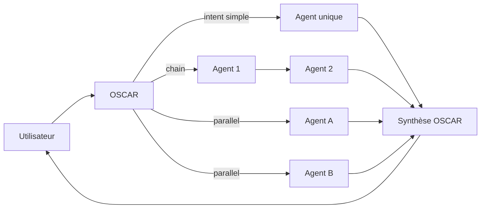

# WORKFLOWS

> Chaînes d'agents/skills nommées, invocables par OSCAR. Chaque workflow a un fichier dédié dans `/workflows/`.

## Convention

Un workflow est un graphe orienté avec :
- **Trigger** (intent user qui le déclenche)
- **Inputs** (obligatoires + optionnels)
- **Étapes** (agent ou skill, avec mapping I/O)
- **Validation humaine** (à quels points)
- **Outputs** (livrables finaux)
- **Persistence** (tables touchées)

## Liste des workflows MVP → V3

| Workflow | Phase | Agents impliqués |
|---|---|---|
| `route_user_request` | MVP | OSCAR (entrée universelle) |
| `workflow_recherche_mandat` | MVP | TOM |
| `workflow_generation_mandat` | MVP | NORA (+ TOM si bien inconnu) |
| `workflow_prospection` | MVP | TOM → SARAH |
| `workflow_compte_rendu` | MVP | LÉA (+ SARAH pour suivi) |
| `workflow_presentation` | V2 | EMMA (+ HUGO pour data) |
| `workflow_social_media` | V2 | STELLA |
| `workflow_video` | V2 | FRANCK + STELLA |
| `workflow_kpi` | V2 | HUGO |
| `workflow_recrutement` | V3 | INÈS (+ STELLA + FRANCK) |
| `workflow_financier` | V3 | GABRIEL (+ SARAH résiliation) |

## Pattern d'orchestration



## Règles transverses

1. Chaque étape produit un **artefact persistant** (DB ou Storage) avant de passer à la suivante.
2. Si une étape échoue → OSCAR remonte l'erreur, ne tronque jamais le workflow silencieusement.
3. Une étape "validation humaine" met le run en statut `needs_input` et attend un événement UI.
4. Tous les workflows loggent dans `agent_runs` + `agent_steps`.
5. Pas de side-effect externe (envoi email, signature) sans passage par une étape humaine.

## Exemple synthétique : `workflow_prospection`

```yaml
name: workflow_prospection
trigger: ["prospecter", "courrier vendeur", "trouver mandats quartier"]
inputs:
  required: [zone_or_url]
  optional: [tonalite, type_mandat_vise]
steps:
  - id: enquete
    agent: tom
    input: { url|zone }
    output: { adresses_candidates[], score, fiche_prospect }
    persist: properties (insert/update)
  - id: redaction
    agent: sarah
    input: { fiche_prospect, tonalite, objectif: "obtenir estimation" }
    output: { courrier_md, sms_md, email_md }
    persist: documents, messages (status=draft)
  - id: validation
    type: human_validation
    blocking: true
outputs:
  - documents.kind = 'courrier'
  - tasks (relance J+7)
```
