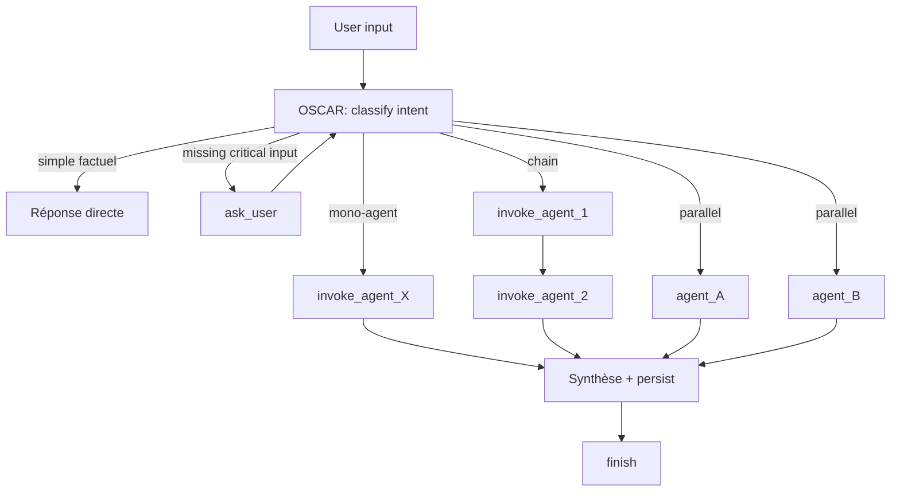

# Workflow — `route_user_request`

> Workflow universel : entrée de toute requête utilisateur. Exécuté par **OSCAR**.

## Trigger
Toute interaction utilisateur (chat, action UI, voix).

## Inputs
- `user_message` (text/audio)
- `context` (auto) : agence, dossier ouvert, modules activés, rôle utilisateur

## Étapes

## Règles
1. Si la demande est factuelle simple → OSCAR répond sans réveiller un agent.
2. Si un input critique manque → 1 seule question (pas plus).
3. Sinon plan + dispatch.
4. Toujours `finish` avec synthèse + livrables + 1-3 next_actions.

## Persistence
- `agent_runs` (1 ligne par run)
- `agent_steps` (N lignes)
- `audit_logs` (actions sensibles)
