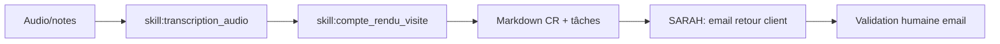

# Workflow — `workflow_compte_rendu`

> Audio/notes → compte rendu structuré. Agent : **LÉA** (+ SARAH pour email retour).

## Trigger
- Upload audio, "Résume cette visite", "Compte rendu de la réunion"

## Inputs
- `audio` ou `transcript` ou `notes`
- `meeting_kind`, `participants[]`, `objective`
- `consent_check` ✅ obligatoire pour audio

## Étapes

## Outputs
- `meeting_reports.summary_md`
- `tasks` créées
- Email vendeur/acheteur en draft
- Points de vigilance
- Prochain rdv suggéré

## Validation humaine
- **Pour l'envoi de l'email** : oui.
- Pour le CR interne : non (il reste interne).

## Persistence
- `meeting_reports`, `tasks`, `messages` (draft)
