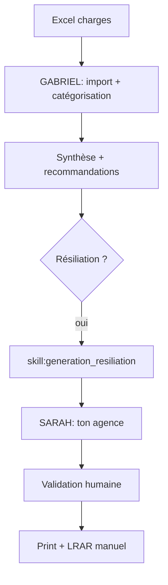

# Workflow — `workflow_financier`

> Pilotage financier. Agent : **GABRIEL** (+ SARAH pour résiliations).

## Trigger
- "Analyse mes charges", "Résilie ce contrat", "Prévision trésorerie"

## Étapes principales

## Outputs
- `financial_records` (insert)
- Synthèse markdown + alertes + recos
- Lettres de résiliation PDF/DOCX
- Prévision trésorerie 3 mois

## Validation humaine
**Obligatoire** sur :
- Toute lettre de résiliation
- Toute action contractuelle
- Toute relance impayé

## Accès RBAC
**admin uniquement** par défaut.

## Persistence
- `financial_records`, `documents` (kind=resiliation)
