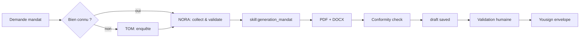

# Workflow — `workflow_generation_mandat`

> Générer un mandat de vente. Agent : **NORA** (+ TOM si bien inconnu).

## Trigger
- "Génère un mandat", "Mandat exclusif pour ...", "Avenant de mandat #..."

## Inputs requis
- Bien (existant en base OU adresse à enquêter via TOM)
- Vendeur(s) avec pièces ID
- Type (`simple|exclusif|semi_exclusif`)
- Prix · honoraires · charge · durée

## Étapes

## Outputs
- `mandate.pdf`, `mandate.docx`
- `conformity_report.md`
- `registry_entry` (n° séquentiel)
- Yousign envelope (sur clic utilisateur)

## Validation humaine
**Obligatoire** avant envoi Yousign.

## Persistence
- `mandates` (`status='draft'` puis `signed` après Yousign callback)
- `documents`
- `audit_logs` (`mandate.created`, `mandate.signed`)
