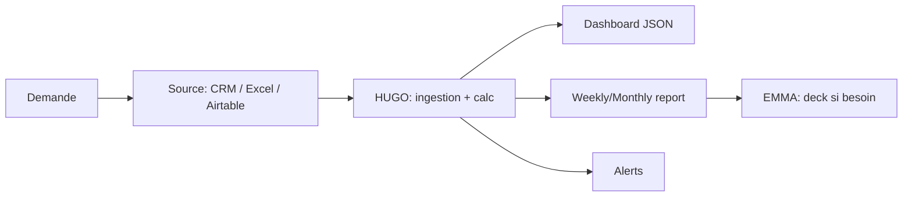

# Workflow — `workflow_kpi`

> Pilotage KPI agence. Agent : **HUGO**.

## Trigger
- "Comment va l'agence ce mois ?", "Ranking négos", "Prépare la réunion commerciale"

## Inputs
- `period`, `team_or_user`, `data_source`

## Étapes

## Outputs
- `kpi_records` (snapshot)
- Dashboard widgets
- Alertes
- Plan de réunion + actions correctives

## Validation humaine
Non.

## Persistence
- `kpi_records` (insert par période)
