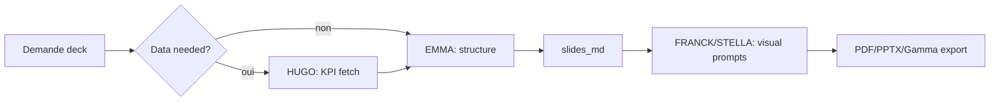

# Workflow — `workflow_presentation`

> Générer un deck de présentation. Agent : **EMMA** (+ HUGO pour data, FRANCK/STELLA pour visuels).

## Trigger
- "Fais un deck pour…", "Pitch pour rdv estimation", "Support de réunion équipe"

## Inputs
- `topic`, `audience`, `objective`, `duration_minutes`
- `data_sources` (HUGO si KPI, NORA si mandat, fiches bien)

## Étapes

## Outputs
- `slides_md`, `pdf`, `gamma_export`
- `speaker_notes`, `visual_prompts`
- Persisté dans `presentations`

## Validation humaine
Non obligatoire (interne). Si présentation client → relire.
