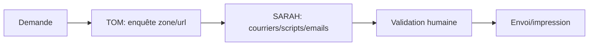

# Workflow — `workflow_prospection`

> Prospecter un quartier ou un bien. Chaîne **TOM → SARAH**.

## Trigger
- "Prospecte le 15e", "Courrier de boîtage", "Trouve-moi des opportunités quartier X"

## Inputs
- `zone` (ville/quartier) **OU** `annonce_url`
- `objective` : `obtenir_estimation|reprendre_contact|relancer_expirés`
- `tone`, `mandate_target`

## Étapes

1. **TOM** identifie biens candidats + fiche prospect
2. **SARAH** rédige courriers, scripts d'appel, emails (variantes A/B)
3. **Validation** humaine
4. Envoi/impression manuel par l'utilisateur

## Outputs
- 1 ou N fiches biens
- 1 ou N courriers/messages multi-canal
- Séquence relance J+3/J+7/J+15
- Tâches créées dans `tasks`

## Persistence
- `properties`, `prospects`, `documents` (kind=courrier), `messages` (status=draft), `tasks`
