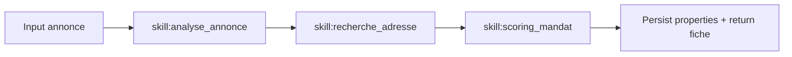

# Workflow — `workflow_recherche_mandat`

> Trouver l'adresse probable d'un bien depuis une annonce. Agent : **TOM**.

## Trigger
- "Trouve l'adresse de ce bien", "C'est où ?", "Analyse cette annonce", URL collée seule.

## Inputs
- **Obligatoire** : `annonce_url` OU `annonce_text` OU `annonce_images[]`
- Optionnels : `city`, `surface`, `dpe`, `prix`, `agency_name`

## Étapes

1. **analyse_annonce** : extraction structurée (texte + vision photos)
2. **recherche_adresse** : croisement DPE/ADEME, DVF, cadastre, Maps, Street View
3. **scoring_mandat** : score 0-100 + priorité commerciale
4. **Persist** : `properties` (insert ou update si déjà connu)

## Outputs
- Top 3-5 candidats avec score
- Fiche prospect mandat
- Recommandation action (`boitage_immediat | enquete | abandonner`)
- Sources utilisées

## Validation humaine
Non. Score < 50 → OSCAR alerte l'utilisateur que la fiabilité est faible.

## Persistence
- `properties` (status `lead` ou `prospect`)
- `agent_runs`, `agent_steps`
