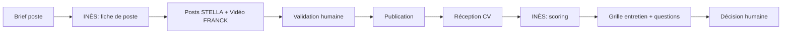

# Workflow — `workflow_recrutement`

> Recrutement immobilier de bout en bout. Agent : **INÈS** (+ STELLA + FRANCK).

## Trigger
- "Fiche de poste pour…", "Score ce CV", "Campagne recrutement négo"

## Étapes

## Outputs
- `candidates` (insert + update)
- `documents` (fiches de poste, grilles d'entretien)
- `social_posts`, `videos` (recrutement)

## Validation humaine
**Obligatoire** sur :
- Publication des posts
- Décision finale d'embauche
- Toute fiche de poste publique
- Filtrage anti-discrimination automatique sur input ET output

## Persistence
- `candidates`, `documents`, `social_posts`, `videos`
