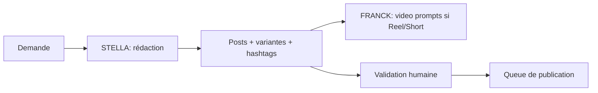

# Workflow — `workflow_social_media`

> Génération de contenu réseaux sociaux. Agent : **STELLA**.

## Trigger
- "Calendrier LinkedIn", "Post Insta sur ce bien", "Carrousel LinkedIn"

## Inputs
- `channel`, `objective`, `tone`, `duration` (calendrier)
- `theme` ou `linked_property_id`

## Étapes

## Outputs
- `social_posts` (status=draft)
- Visuel prompts
- Calendrier ICS exportable

## Validation humaine
**Obligatoire** avant publication.

## Persistence
- `social_posts`
