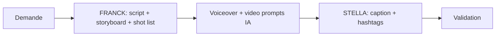

# Workflow — `workflow_video`

> Production vidéo immobilière. Agents : **FRANCK** + **STELLA**.

## Trigger
- "Reel pour ce bien", "Vidéo recrutement", "Avant/après"

## Inputs
- `video_kind`, `target_channel`, `duration_seconds`, `style`
- Photos / vidéo brute / fiche bien

## Étapes

## Outputs
- `videos.script_md`, storyboard, shot list
- Voiceover, prompts Runway/Luma
- Caption + hashtags multi-canal
- Persisté dans `videos`

## Validation humaine
Non bloquante en interne. Avant publication client : oui.
